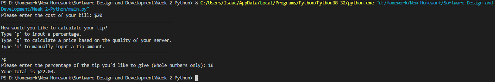
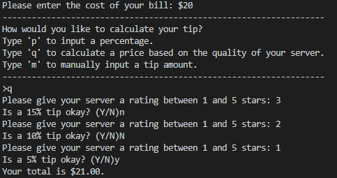
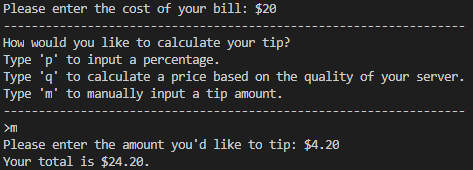

# Overview

This is a tip calculating program where the user may input a bill amount and select several different means of calculating a tip.
These include:
1. The user inputting a percentage of their bill.
2. The user giving their server a rating from 1 to 5 stars.
3. The user manually inputting their desired tip amount.

It then calculates the total price of their bill and displays it.

# Development Environment

* Python 3.8.5
* Visual Studio Code

# Execution

To run: `python main.py`   
<b>Percent:</b>  
  
<b>Quality:</b>  
  
<b>Manual:</b>  

# Useful Websites

1. [Python Reference](https://docs.python.org/3/genindex-I.html)
2. [Stack Overflow Python Questions](https://stackoverflow.com/questions/tagged/python)
3. [W3Schools Python Tutorial](https://www.w3schools.com/python/)